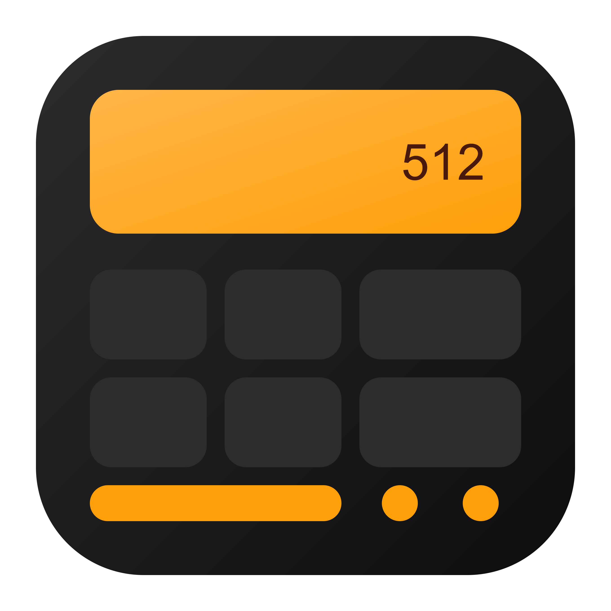
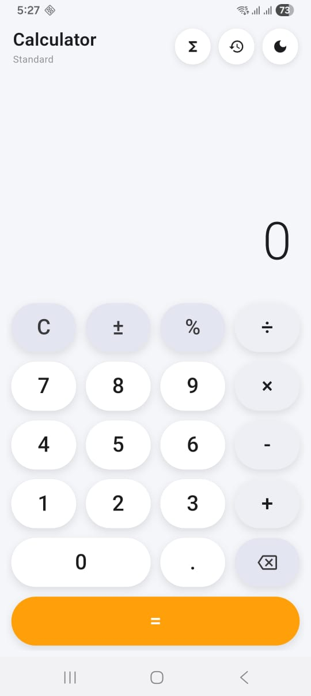
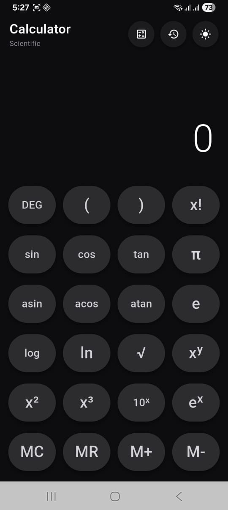
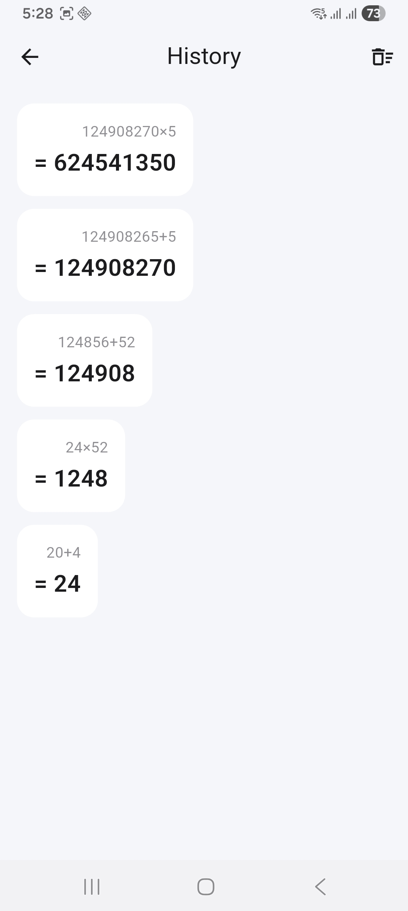

# 🧮 Calculass

<p align="center">
  
</p>

A beautiful **Flutter-based Calculator Application** featuring both **Standard** and **Scientific Calculator** modes with elegant Light & Dark themes, smooth animations, and a premium user experience.

---

## 🚀 Overview

**Calculass** is a modern calculator app designed with a clean, professional interface and powerful mathematical capabilities. Whether you need quick everyday calculations or advanced scientific functions, Calculass provides a fast, accurate, and intuitive experience.

Built entirely with **Flutter**, the application follows Material 3 design principles and offers a seamless experience across Android devices.

---

## ✨ Features

### 🧮 Standard Calculator

* ➕ Addition
* ➖ Subtraction
* ✖️ Multiplication
* ➗ Division
* 📊 Percentage Calculations
* 🔢 Decimal Support
* 🔄 Positive / Negative Toggle
* ⌫ Backspace Function
* 🧹 Clear All Operations
* ⚡ Instant Results

### 🔬 Scientific Calculator

* 📐 Trigonometric Functions (sin, cos, tan)
* 📈 Inverse Trigonometric Functions
* 📊 Logarithmic Functions (log, ln)
* √ Square Root
* x² and Power Functions
* ❗ Factorial
* π Pi Constant
* e Euler Constant
* () Parentheses Support
* 📏 Degree / Radian Modes

### 🎨 User Experience

* 🌙 Dark Mode
* ☀️ Light Mode
* ✨ Smooth Theme Switching
* 🎭 Beautiful Animations
* 📱 Responsive Layout
* ⚡ Fast Performance
* 📋 Copy Results
* 📜 Calculation History
* 📳 Haptic Feedback Support

---

## 🛠️ Technologies Used

* Flutter
* Dart
* Material 3
* Provider / Riverpod
* Shared Preferences
* Math Expressions
* Flutter Native Splash

---

## ⚙️ Workflow

1. Launch Calculass
2. Select Standard or Scientific Mode
3. Enter mathematical expressions
4. Instantly view results
5. Access calculation history
6. Switch between Light and Dark themes
7. Copy results when needed
8. Continue calculations seamlessly

---

## 📸 Screenshots

<p align="center">
  
  
  
</p>

---

## 📦 Installation

```bash
git clone https://github.com/AhmadSambil/flutter-scientific-calculator.git
```

```bash
cd flutter-scientific-calculator
flutter pub get
flutter run
```

---

## 🚀 Build Release APK

```bash
flutter build apk --release
```

APK location:

```text
build/app/outputs/flutter-apk/
```

---

## 📁 Project Structure

```text
lib/
 ├── main.dart
 ├── screens/
 │    ├── calculator_screen.dart
 │    ├── scientific_screen.dart
 │    └── history_screen.dart
 │
 ├── widgets/
 │    ├── calculator_button.dart
 │    ├── display_widget.dart
 │    └── custom_appbar.dart
 │
 ├── services/
 │    └── calculator_service.dart
 │
 ├── providers/
 │    └── calculator_provider.dart
 │
 ├── themes/
 │    └── app_theme.dart
 │
 └── models/
      └── history_model.dart
```

---

## 👨‍💻 Developer

**Ahmad Hossain Sambil**

📧 Email: [sambilhassan@gmail.com](mailto:sambilhassan@gmail.com)

🌐 GitHub: https://github.com/AhmadSambil

📱 Flutter Developer

---

## ⭐ Support

If you like this project, please consider giving it a ⭐ star on GitHub.

Your support helps improve Calculass and motivates future development.

---

## 📄 License

This project is available for educational and personal use.

---

<div align="center">

**Made with 💙 by [Ahmad Sambil](https://github.com/AhmadSambil)**

*If this project helped you, please give it a ⭐ — it means a lot!*

[](https://github.com/AhmadSambil/flutter-scientific-calculator/stargazers)

</div>
